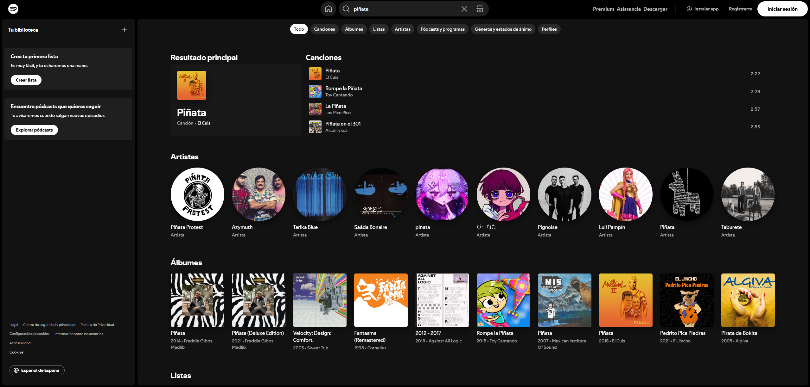

# Descripción técnica de la interfaz --- página de búsqueda `search/{cadenaBuscada}` (Spotify)
## Autor: Diego Torroba

> Documento escrito **como desarrollador**: descripción de la UI,
> estructura de componentes, comportamiento esperado, accesibilidad,
> rendimiento y notas de implementación para la página
> `https://open.spotify.com/search/{cadenaBuscada}`.



------------------------------------------------------------------------

## 1. Resumen / objetivo

La ruta `/search/{cadenaBuscada}` muestra los resultados de búsqueda
para el término ingresado por el usuario dentro del reproductor web de
Spotify. La interfaz organiza los datos en **bloques por tipo de
contenido** (canciones, artistas, álbumes, playlists, episodios de
podcast, perfiles, etc.), siempre acompañados de controles contextuales
y opciones de reproducción.

El objetivo principal de la página es permitir:

-   Navegación rápida entre tipos de contenido.
-   Reproducción inmediata (preview o pista completa según permisos).
-   Acciones rápidas (guardar, compartir, añadir a playlists).
-   Ubicación clara del resultado principal o más relevante ("Top
    Result").

------------------------------------------------------------------------

## 2. Layout visual (alto nivel)

-   **Header**: contiene la barra de búsqueda persistente con icono de
    búsqueda, junto con menú de usuario. Puede mantenerse fijo.
-   **Columna principal**: incluye un Top Result si existe y secciones
    por tipo en formato lista o grid.
-   **Componentes de fila**: miniatura, textos, íconos de acción y hover
    con botón de Play.
-   **Footer / Player**: reproductor fijo visible en toda la navegación.

------------------------------------------------------------------------

## 3. Componentes principales

-   `SearchPage`
-   `SearchBar`
-   `TopResultCard`
-   `Section`
-   `ResultRow` / `ResultCard`
-   `InlinePlayerButton`
-   `ContextMenu`
-   `GlobalPlayer`

``` jsx
export function SearchPage(){ 
  const { q } = useRouteParams();
  const results = useSearchResults(q);

  return (
    <Layout>
      <SearchBar defaultValue={q}/>
      <TopResultCard item={results.top}/>
      <Section title="Songs" items={results.tracks}/>
      <Section title="Artists" items={results.artists}/>
      <Section title="Albums" items={results.albums}/>
      <Section title="Playlists" items={results.playlists}/>
      <GlobalPlayer />
    </Layout>
  );
}
```

------------------------------------------------------------------------

## 4. Flujo de datos y estado

-   **Origen de datos**: Search API con paginación por tipo.
-   **Estado local**: query, results, reproducción, UI, caché temporal.
-   **Caching**: mantener resultados previos con TTL 60--120s.
-   **Debounce**: 250--350ms para evitar llamadas excesivas.

------------------------------------------------------------------------

## 5. Interacciones y comportamiento

-   Búsqueda en vivo con sugerencias.
-   Play inline con control desde el player global.
-   "Ver todo" para abrir vistas expandidas.
-   Menú contextual accesible con teclado.
-   Navegación con teclado (flechas, Enter, Escape).
-   URLs compartibles por recurso.

------------------------------------------------------------------------

## 6. Accesibilidad (a11y)

-   Roles semánticos adecuados.
-   `aria-label` descriptivo en acciones.
-   Focus visible.
-   `aria-live` para acciones asincrónicas.
-   Texto alternativo en imágenes.
-   Menús completamente navegables por teclado.

------------------------------------------------------------------------

## 7. Estilos y responsive

-   Grid de 12 columnas.
-   En móvil: listas verticales.
-   Imágenes adaptativas (`srcset`).
-   Animaciones suaves (opacity + transform).
-   Uso consistente de tokens de diseño.

------------------------------------------------------------------------

## 8. Rendimiento

-   Lazy load de imágenes.
-   Skeletons de carga.
-   Prefetch de rutas relacionadas.
-   Minimización del bundle y memoización.

------------------------------------------------------------------------

## 9. Manejo de errores y estados vacíos

-   Mensaje "No results".
-   Banner de error no intrusivo.
-   Modo offline con resultados en caché.
-   Time-outs controlados.

------------------------------------------------------------------------

## 10. Tests y métricas

-   Unit tests para hooks y helpers.
-   Integration tests para SearchBar + SearchPage.
-   E2E para accesibilidad, reproducción y navegación.
-   Métricas: TTFR, interacción por sección, errores del API.

------------------------------------------------------------------------

## 11. Privacidad y permisos

-   Validación de scopes.
-   No almacenar tokens sensibles en cliente.
-   Telemetría mínima y configurable.
-   Sanitización de entradas de búsqueda.

------------------------------------------------------------------------

## 12. Notas de implementación rápidas

-   Patrones: Container/Presentational, Hooks, Suspense.
-   Uso de WebP cuando posible.
-   Evitar dependencias pesadas.
-   Estado centralizado para el Global Player.

------------------------------------------------------------------------
